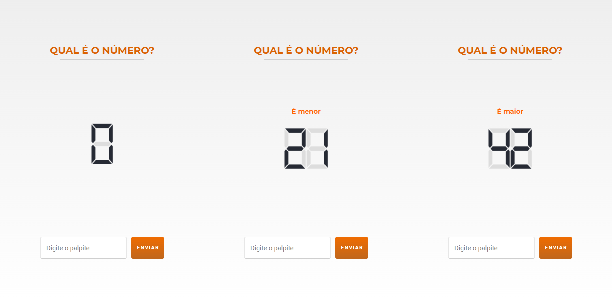

# Prova Técnica Studio Sol

O problema consiste em receber um número através de uma requisição e implementar
um jogo para acertar este número através de palpites. ​Ao errar um palpite, será
informado se o número obtido é maior ou menor do que o palpite feito. O palpite
realizado ou ​status code​ de erro de requisição devem ser exibidos na tela no
formato de LED de 7 segmentos. O palpite será obtido como entrada em um campo de
texto, que deverá ser processado apenas quando o botão ENVIAR for clicado.

Para solucionar o problema proposto, você deverá implementar a solução
utilizando, HTML, CSS e Javascript.


## Implementação

| Legenda             |
| ------------------- |
| ✔️ Implementado     |
| ❌ Não implementado |

### Segmentos:

- ✔️ O display pode conter números não-negativos de 1 a 3 algarismos.
- ✔️ O valor numérico exibido nos segmentos deve representar o palpite realizado
  ou o status code obtido quando a requisição falhar.
- ✔️ Só deve ser apresentada a quantidade de algarismos necessária (O número 29
  precisar ser exibido sem zero à esquerda).
- ✔️ Você deve implementar sua própria solução para exibir os segmentos. Não
  serão aceitas bibliotecas de terceiros para esta etapa. Em especial, ​**NÃO**​
  utilize uma fonte pronta para exibir os segmentos. Botão ​NOVA PARTIDA​:
- ✔️ O botão ficará visível apenas quando houver erro ao receber o número ou
  quando o jogador acertou o palpite

### Campo de entrada:

- ✔️ Mostrar o texto "Digite o palpite" como placeholder
- ✔️ O valor deve aparecer nos segmentos assim que o botão ​ENVIAR ​for clicado
  e o input deve ser resetado para o estado inicial.
- ✔️ O botão de enviar deverá ficar desabilitado quando houve erro ao receber o
  número ou quando o jogador acertou o palpite. O usuário deve clicar em "NOVA
  PARTIDA" neste caso.



## Biblioteca Studio Led:

No teste diz que não podemos utilizar bibliotecas criadas por terceiros para
criar a lógica do LED display. A biblioteca Studio LED foi criada por mim para
esse teste. Vocês podem obter mais informações sobre ela nos links abaixo:

- github: https://github.com/inkasadev/studioled
- npm: https://www.npmjs.com/package/studioled


## Instalação

```sh
$ npm run setup
```

Você pode conferir o projeto finalizado [clicando aqui]().
